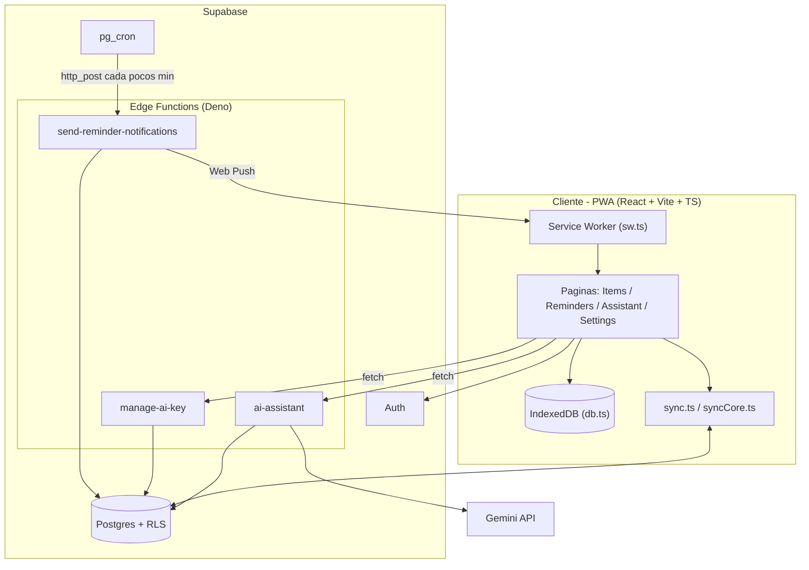
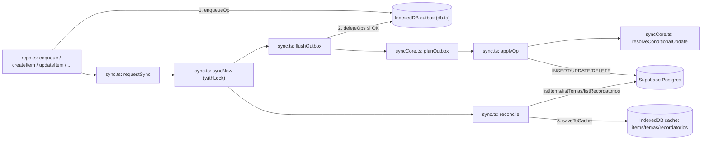
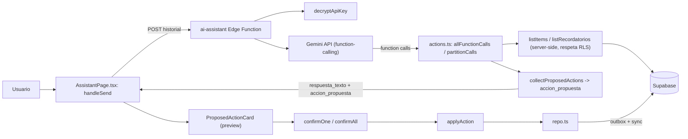
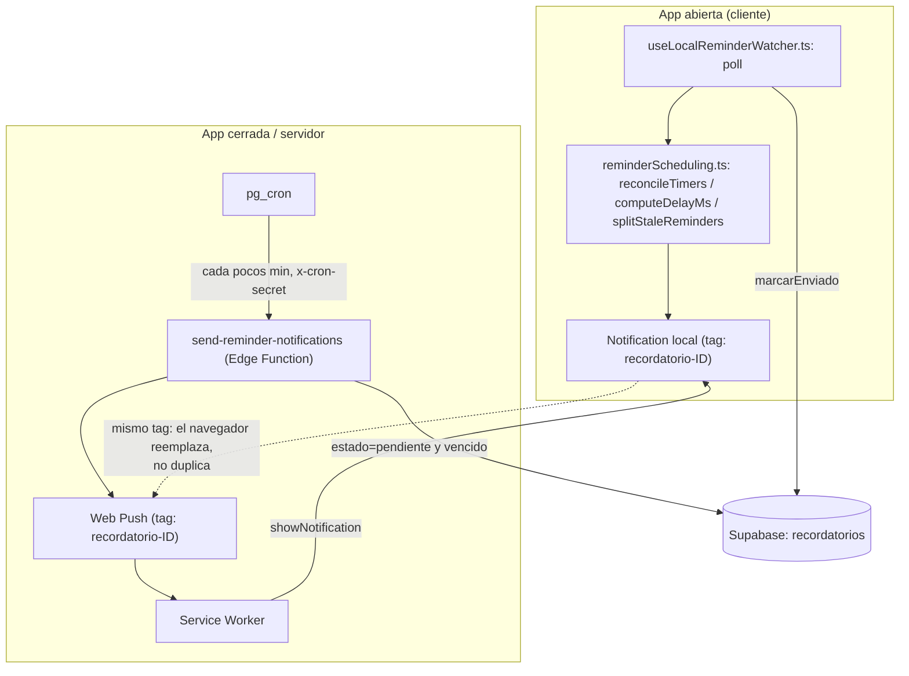

# Mapa del proyecto

> Generado con [Graphify](graphify-out/GRAPH_REPORT.md) (grafo de conocimiento) + [Noodles](https://github.com/) (call graphs). Este documento es el mapa de orientación rápida — para historial de decisiones y detalle de cada feature, ver [PLAN_ORGANIZADOR.md](PLAN_ORGANIZADOR.md) y [PLAN_OFFLINE.md](PLAN_OFFLINE.md).

## Qué es el proyecto

**Organizador** es una PWA personal (React + Vite + TypeScript) para gestionar notas, ítems y recordatorios, con soporte **offline-first** completo (lectura y escritura vía IndexedDB + outbox + motor de sincronización con Supabase), un **asistente de IA** (Gemini con function-calling) que propone cambios en lenguaje natural para que el usuario confirme antes de aplicarlos, y **recordatorios con doble vía de aviso**: local (mientras la app está abierta) y por push server-side (Edge Function disparada por `pg_cron`, funciona con la app cerrada).

## Estructura de carpetas y responsabilidad de cada módulo

### `src/lib/` — lógica de dominio y offline
| Módulo | Responsabilidad |
|---|---|
| `repo.ts` | Repositorio de mutaciones locales — único punto de entrada para escrituras (`createItem`, `updateItem`, `deleteItem`, `upsertRecordatorio`, `enqueue`). Escribe en IndexedDB y encola la operación en el outbox. |
| `db.ts` | Capa de IndexedDB (`idb`): cache local de `items`/`temas`/`recordatorios`, la tabla `outbox` y `meta`. |
| `syncCore.ts` | Lógica **pura** de reconciliación (`planOutbox`, `resolveConditionalUpdate`, `classifySyncError`, `backoffDelayMs`) — sin efectos secundarios, 100% testeable. |
| `sync.ts` | Motor de sync con estado runtime (`runSync`, `flushOutbox`, `reconcile`, `startSyncEngine`, `syncNow`) — llamadas reales a Supabase, listeners online/focus/visibility, lock single-flight. |
| `useLocalReminderWatcher.ts` | Hook que sondea (`poll`) recordatorios pendientes mientras la app está abierta y dispara el aviso local. |
| `reminderScheduling.ts` | Lógica pura de temporizadores: arma timers, calcula el delay, separa recordatorios "a tiempo" de los atrasados (catch-up). |
| `push.ts` | Suscripción/desuscripción a Web Push (VAPID). |
| `items.ts`, `temas.ts`, `recordatorios.ts` | Helpers de dominio (listados, formato de fecha, parseo de contenido). |
| `AuthContext.tsx`, `useAiEnabled.ts`, `useSyncStatus.ts`, `useRecordatoriosBadge.ts` | Contexto/hooks transversales usados por varias páginas. |

### `src/components/` y `src/pages/`
UI reutilizable (`ItemForm`, `ItemList`, `SyncStatus`, `SyncSettings`, `SyncEngine`, `PushSettings`, `AppShell`, `AuthCard`, `ProtectedRoute`) y vistas ruteadas (`HoyPage`, `ItemsPage`, `RemindersPage`, `SettingsPage`, `AuthPage`, `ResetPasswordPage`).

Sobre el ruteo: `App.tsx` tiene el `BrowserRouter` arriba de todo y la sesión se
exige en un layout route (`RutasPrivadas` = `ProtectedRoute` + `SyncEngine` +
`LocalReminderWatcher`). `/reset-password` queda **fuera** de esa puerta a
propósito: la abre quien no puede iniciar sesión.

### `src/sw.ts`
Service Worker: maneja el payload de push y muestra la notificación. Sin cache runtime de datos de Supabase (decisión explícita, ver PLAN_OFFLINE.md).

### `supabase/functions/` — Edge Functions (Deno)
| Función | Responsabilidad |
|---|---|
| `ai-assistant/index.ts` + `actions.ts` | Recibe el historial de chat, llama a Gemini con function-calling, ejecuta **solo lecturas** (`listItems`/`listRecordatorios`) server-side respetando RLS, y devuelve **propuestas** de creación/edición/borrado sin aplicarlas nunca del lado del servidor. |
| `manage-ai-key/index.ts` | Cifra (AES-GCM) y guarda la API key de Gemini del usuario; nunca la devuelve en claro. |
| `send-reminder-notifications/index.ts` | **No la invoca el usuario** — la dispara `pg_cron` cada pocos minutos vía `net.http_post` con `service_role`. Busca recordatorios vencidos, manda Web Push, marca `enviado` o limpia suscripciones expiradas (410/404). |

### `supabase/migrations/`
`schema_inicial` (temas/items/recordatorios + RLS), `user_ai_settings`, `ai_usage`, `push_subscriptions`, `recordatorios_updated_at` (fix del trigger para respetar LWW por `updated_at`).

---

## Diagramas

### 1. Arquitectura general

Vista de alto nivel: el cliente PWA habla con Supabase (Auth, Postgres+RLS, Edge Functions) y con Gemini a través de la Edge Function del asistente. `pg_cron` es el único disparador de la Edge Function de notificaciones — no hay servidor propio.

### 2. Flujo de datos offline

`repo.ts` nunca escribe directo a Supabase: toda mutación pasa primero por IndexedDB y el outbox. El motor de sync (`sync.ts`) vacía el outbox contra Supabase usando la lógica pura de `syncCore.ts` para resolver conflictos (LWW por `updated_at`), y separado reconcilia trayendo el estado fresco del servidor.

### 3. Flujo del asistente de IA

El asistente solo **propone**: las lecturas (`listItems`/`listRecordatorios`) se ejecutan server-side con el JWT del usuario (respetan RLS), pero cualquier creación/edición/borrado vuelve al cliente como `accion_propuesta` para preview y confirmación explícita antes de tocar `repo.ts`.

### 4. Flujo de notificaciones (local vs. servidor + dedup)

Dos caminos independientes escriben la misma notificación: el watcher local (app abierta) y el cron del servidor (app cerrada). Ambos usan el **mismo tag** `recordatorio-${id}` — si los dos llegan a dispararse para el mismo recordatorio, el navegador reemplaza en vez de duplicar. El catch-up de atrasados usa un tag fijo (`recordatorios-catchup`) que se reemplaza a sí mismo si se acumulan varios.

---

## God nodes (módulos centrales según Graphify)

Los nodos más conectados del grafo — si algo se rompe cerca de estos, el radio de impacto es grande:

1. `useAuth()` (`AuthContext.tsx`) — 23 aristas — casi toda página/hook depende de la sesión.
2. `getDB()` (`db.ts`) — 22 aristas — punto único de acceso a IndexedDB.
3. `flushOutbox()` (`sync.ts`) — 14 aristas — corazón del vaciado del outbox.
4. `RemindersPage()` — 14 aristas.
5. `supabase` (cliente, `supabase.ts`) — 12 aristas.
6. `reconcile()` (`sync.ts`) — 12 aristas.
7. `Item` (tipo, `database.ts`) — 12 aristas — el shape más compartido del proyecto.
8. `enqueue()` (`repo.ts`) — 11 aristas — todo mutación pasa por acá.

El grafo completo (29 comunidades, incluye documentación y decisiones de diseño enlazadas al código) está en [graphify-out/GRAPH_REPORT.md](graphify-out/GRAPH_REPORT.md) y navegable interactivamente en `graphify-out/graph.html`.
